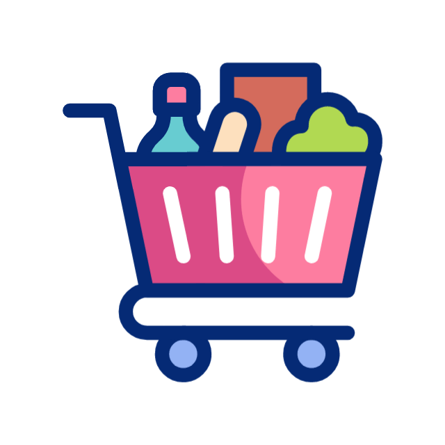

# 🛍️ Customer Behavior Analysis | Data Analyst Portfolio Project


## 📊 Overview
This project provides a comprehensive analysis of customer shopping behavior to unlock actionable business insights. By leveraging **SQL** for data extraction and **Power BI** for advanced visualization, I've identified key trends in revenue, customer segmentation, and product performance.

### 🎯 Key Objectives:
- **Revenue Optimization**: Identify top-performing categories and products.
- **Customer Segmentation**: Categorize customers into New, Returning, and Loyal segments.
- **Marketing Effectiveness**: Analyze the impact of discounts and subscription status on purchase behavior.
- **Operational Insights**: Evaluate shipping methods and customer satisfaction (ratings).

---

## 🛠️ Tech Stack
- **SQL Server**: Data querying, cleaning, and business logic implementation.
- **Power BI**: Interactive dashboards and data storytelling.
- **CSV Data**: Raw shopping behavior dataset.

---

## 📂 Project Structure
```text
├── 📂 data/                # Raw CSV dataset
├── 📂 dashboards/          # Power BI (.pbix) files
├── 📂 reports/             # Exported PDF reports
├── 📂 sql/                 # SQL script with business queries
└── 📂 docs/assets/         # Visual assets and icons
```

---

## 💡 Business Insights & Impact

### 1. Revenue by Category

- **Problem**: Which category contributes most to the bottom line?
- **Finding**: Identified the highest-revenue-generating categories to prioritize inventory.
- **SQL Logic**: Grouped by category and summed total purchase amounts.

### 2. Discount Effectiveness

- **Problem**: Are discounts actually increasing the average purchase value?
- **Finding**: Compared average spend with and without discounts to optimize pricing strategies.

### 3. Customer Segmentation
.gif)
- **Problem**: Generic marketing is inefficient.
- **Finding**: Segmented customers into **New**, **Returning**, and **Loyal** based on purchase history.
- **Impact**: Enables highly targeted marketing campaigns and loyalty programs.

### 4. Shipping Performance

- **Problem**: Does faster shipping lead to higher customer spend?
- **Finding**: Analyzed the correlation between shipping types (Standard vs. Express) and order values.

---

## 🚀 How to Use This Project

### SQL Analysis
1. Navigate to the `sql/` folder.
2. Run `BUSINESS_INSIGHTS.sql` in your SQL environment (e.g., SQL Server Management Studio).
3. The queries are structured to answer specific business questions with "Problem" and "Impact" comments.

### Power BI Dashboard
1. Navigate to the `dashboards/` folder.
2. Open `Customer_behaviour_analysis.pbix` (Requires Power BI Desktop).
3. Explore interactive visuals for age demographics, rating trends, and seasonal insights.

---

## 📈 Sample Visuals
| Segment Analysis | Purchase Trends |
| :---: | :---: |
|  |  |

---

## 📫 Contact & Connect
- **GitHub**: [vishwjit04](https://github.com/vishwjit04)
- **LinkedIn**: [Vishwjit](https://www.linkedin.com/in/vishwjit)
- **Email**: [vishwjit04@gmail.com](mailto:vishwjit04@gmail.com)

---
*Created by Vishwjit as part of a Data Analysis Portfolio.*
